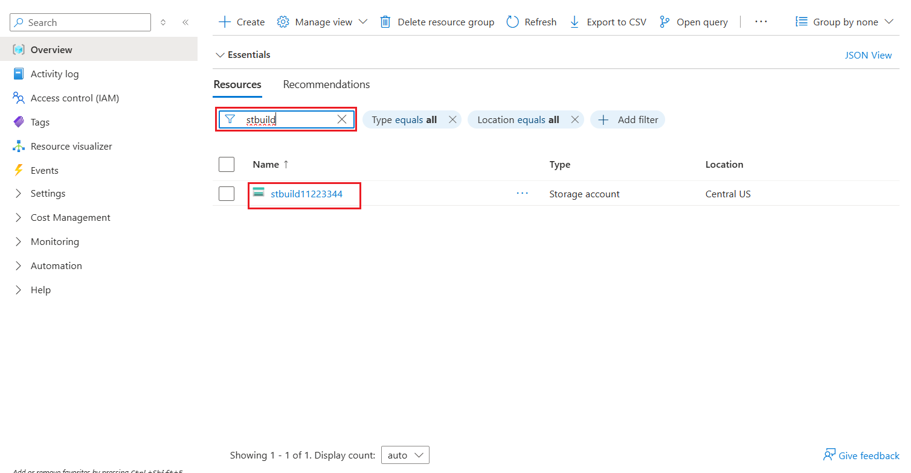
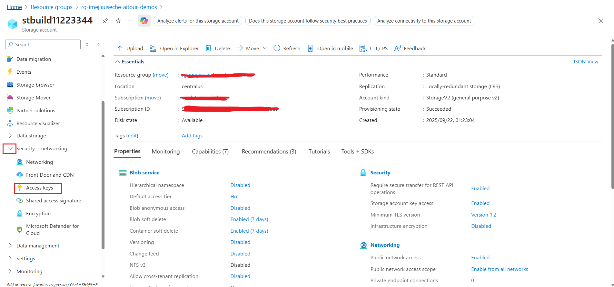

## Task 1.2: Use the New Shortcut option from external data sources

Now, this is something exciting! This section shows how easy it is to create Shortcuts without moving data. That is the power of OneLake! In this exercise, you will ingest the curated bounce rate data for Litware from ADLS Gen2 using the New Shortcut option. Let’s see how!

### Get the Storage Account Key

1. In the virtual machine, open a new tab in your web browser and navigate to `https://portal.azure.com/` then sign in using the credentials provided for this lab.

2. In the Azure portal, search for `rg-build25-@lab.LabInstance.Id`. Select the resource group from the search results.

    

3. In your resource group search for `stbuild@lab.LabInstance.Id`. Select the storage account from the search results.

    

4. In the storage account pane, expand **Security + networking**, select **Access keys**.

    

5. Copy the **Key1** value by selecting the **Show** button and then the **Copy to clipboard** icon.

### Create a Shortcut to ADLS Gen2 in the Lakehouse

1. Navigate back to Microsoft Fabric tab on your browser (`https://app.fabric.microsoft.com`).

2. Inside the *ZavaLakehouse*, select the **three dots (ellipses)** on the right side of Files.

3. Select **New Shortcut**.

    > [!NOTE]
    > **Note:** Make sure you create a shortcut under **Files** and not under **tables** in the lakehouse explorer pane.

    

4. In the pop-up window, under **External sources**, select the **Azure Data Lake Storage Gen2** source.

    

5. On the pop-up window, select **New connection**.

6. In the screen below, we need to enter the connection details for the **ADLS Gen2** shortcut.

    

7. Enter the following connection details:
   - **URL**: `https://stbuild@lab.LabInstance.Id.dfs.core.windows.net/`
   - **Authentication Kind**: Select **Account Key**
   - **Account Key**: Paste the copied **Key1** value from the previous section.
    > [!NOTE]
    > Your key might be replaced as you are using the `icon` to copy other values. Please make sure to copy it again if needed.

8. Then select **Next**.

    

9. Select the **data** and **litwaredata** checkbox and then click on the **Next** button.

    

10. Click on the **Create** button.

    

11. And there you go! Your shortcut is now ready! Click (do not expand) on the newly created shortcut named **litwaredata**.

    

Prior to Microsoft Fabric, departments at Zava had to move the data they needed from other departments via time-consuming ETL processes. But look, now they have created shortcuts. No need to move any of this data. That is the power of OneLake!

### Next Step

> Select **Next >** to Create Delta Tables using a Spark Notebook.
