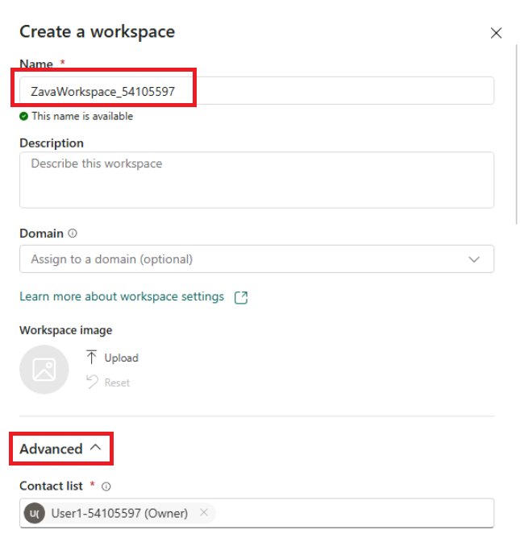
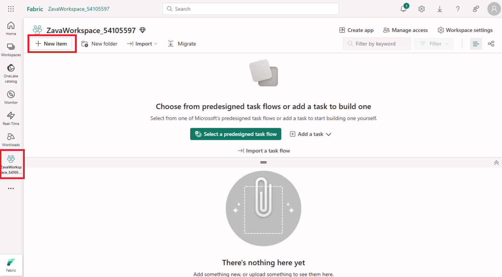
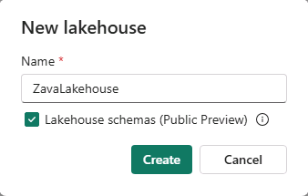
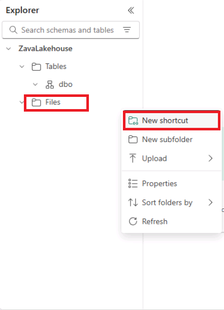
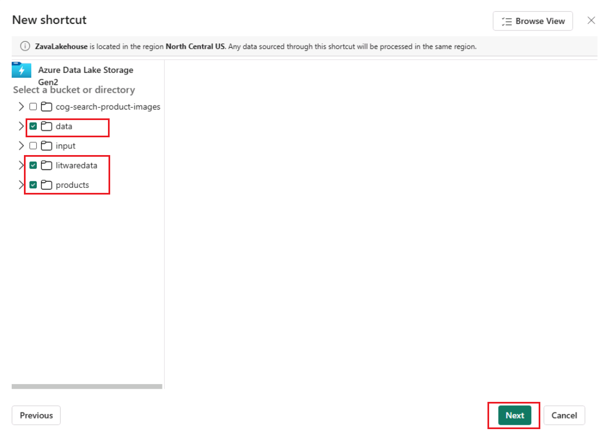
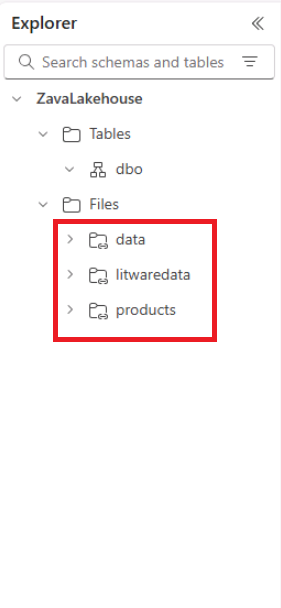
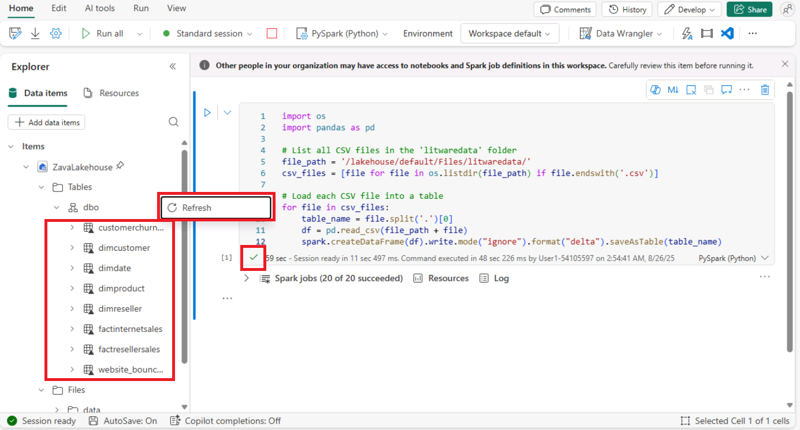

# Tutorial 1: Data ingestion from a spectrum of analytical data sources into OneLake

*Before we start executing the steps, we will open a backup Click-by-Click lab using the following hyperlink in a new tab and navigate back to the VM browser:*

[Click-by-Click](https://regale.cloud/microsoft/play/3781/modern-analytics-with-microsoft-fabrikam-copilot-and-azure-databricks-dream-lab-#/0/0)

## Task 1.1: Create a Microsoft Fabric enabled workspace

In this exercise, you will act as the Data Engineer, Bryan, to transfer Zava's data from ADLS Gen2 into the Lakehouse and initiate data preparation for the upcoming merger between Zava and Litware Inc.

1. In the virtual machine, open a web browser and browse to `https://app.fabric.microsoft.com`.
2. When prompted, sign in using the following credentials:

    * **Email**: `@lab.CloudPortalCredential(User1).Username`
    * **Password**: `@lab.CloudPortalCredential(User1).Password`

3. If prompted to stay signed in, select **Yes**.

    > [!NOTE]
    > **Note**: Close any pop-up dialogs that appear on the screen.

4. Select **Continue** and on the **Job Title** box enter `Data Expert`. On the **Business Phone Number** box enter `1230000849` then select **Get Started**.

    > [!NOTE]
    > **Note:** Wait for the Power BI workspace to load and *close* the top bar for a better view.

5. Select **Workspaces** from the left navigation pane. Then select **+ New workspace**.

    

6. Enter a name for the workspace, such as `ZavaWorkspace_@lab.LabInstance.Id`. Expand the **Advanced** option and make sure **Fabric Capacity** is selected then select **Apply** when done.

    

    

    > [!NOTE]
    > **Note**: The workspace name must be unique across the Fabric tenant. If you receive an error, try a different name. Close any pop-up dialogs that appear on the screen.

### Create a Lakehouse

Now, let's see how each department can easily create a Lakehouse in the Zava workspace without any provision. They simply provide a name, given the proper access rights of course!

1. In the Zava workspace you created, select **+ New Item** from the top menu.

    

2. In the **New Item** pane, search for **Lakehouse** and select **Lakehouse**.

    

3. Enter a name for the Lakehouse, such as `ZavaLakehouse`.

4. Select the **Lakehouse schemas** checkbox and then select **Create**.

    

In just a few seconds, Lakehouse was created by simply providing a name and no resource provisioning was needed. With the right access, you, as a Data Engineer, can effortlessly create a new Lakehouse. There is no need to set up any storage accounts or worry about network, infrastructure, key vault, Azure subscriptions, etc.

### Next Step

> Select **Next >** to Ingest data from external sources using shortcuts.

===

!INSTRUCTIONS []()

## Task 1.2: Use the New Shortcut option from external data sources

Now, this is something exciting! This section shows how easy it is to create Shortcuts without moving data. That is the power of OneLake! In this exercise, you will ingest the curated bounce rate data for Litware from ADLS Gen2 using the New Shortcut option. Let’s see how!

1. Inside the *ZavaLakehouse*, select the **three dots (ellipses)** on the right side of Files.

2. Select **New Shortcut**.

    > [!NOTE]
    > **Note:** Make sure you create a shortcut under **Files** and not under **tables** in the lakehouse explorer pane.

    

3. In the pop-up window, under **External sources**, select the **Azure Data Lake Storage Gen2** source.

    

4. On the pop-up window, select **New connection**.

5. In the screen below, we need to enter the connection details for the **ADLS Gen2** shortcut.

    

6. Enter the following connection details:
   - **URL**: `https://stbuild@lab.LabInstance.Id.dfs.core.windows.net/`
   - **Authentication Kind**: Select **Account Key**
   - **Account Key**: `@lab.Variable(storageaccountkey)`

7. Then select **Next**.

    

8.  Select the **data** and **litwaredata** checkbox and then click on the **Next** button.

    

9. Click on the **Create** button.

    

10. And there you go! Your shortcut is now ready! Click (do not expand) on the newly created shortcut named **litwaredata**.

    

Prior to Microsoft Fabric, departments at Zava had to move the data they needed from other departments via time-consuming ETL processes. But look, now they have created shortcuts. No need to move any of this data. That is the power of OneLake!

### Next Step

> Select **Next >** to Create Delta Tables using a Spark Notebook.

!INSTRUCTIONS []()

===

## Task 1.3: Create Delta Tables using Spark Notebook

Now, let’s see how Data Engineer, Bryan, got the remaining data into OneLake by creating Delta tables using Spark Notebook. By using a Spark Notebook to create Delta tables, Bryan can ensure more reliable, scalable, and efficient data management, which is essential for handling big data workflows.

1. Inside the **ZavaLakehouse**, select **Open Notebook** then choose **New Notebook**.

    

2. Once the notebook is created, paste the **below code** in the existing cell and run the cell by clicking on the **Run cell** icon.

    ```python
    import os
    import pandas as pd
     
    # List all CSV files in the 'litwaredata' folder
    file_path = '/lakehouse/default/Files/litwaredata/'
    csv_files = [file for file in os.listdir(file_path) if file.endswith('.csv')]
     
    # Load each CSV file into a table
    for file in csv_files:
        table_name = file.split('.')[0]
        df = pd.read_csv(file_path + file)
        spark.createDataFrame(df).write.mode("ignore").format("delta").saveAsTable(table_name)
    ```

3. Once the code cell runs successfully, you will see a green tick at the bottom of the cell. Now, expand the **Tables** section, expand **dbo**, select on the **three dots** and the select **Refresh**. You should see the newly created Delta tables listed here.

    

4. You now have all the tables in **OneLake** for Zava to leverage.

### Next Step

> Select **Next >** to Build DLT Pipelines in Azure Databricks