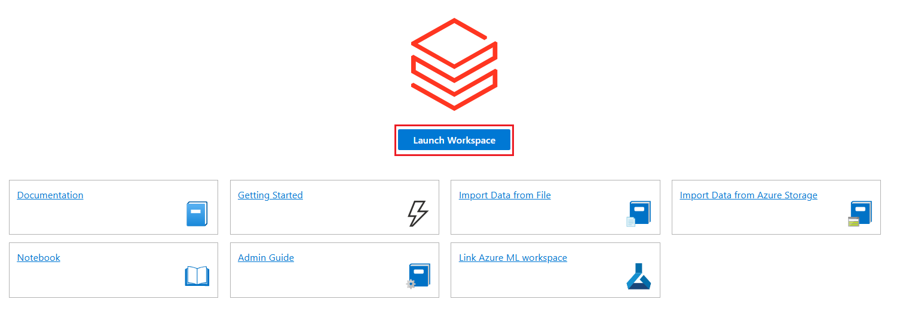
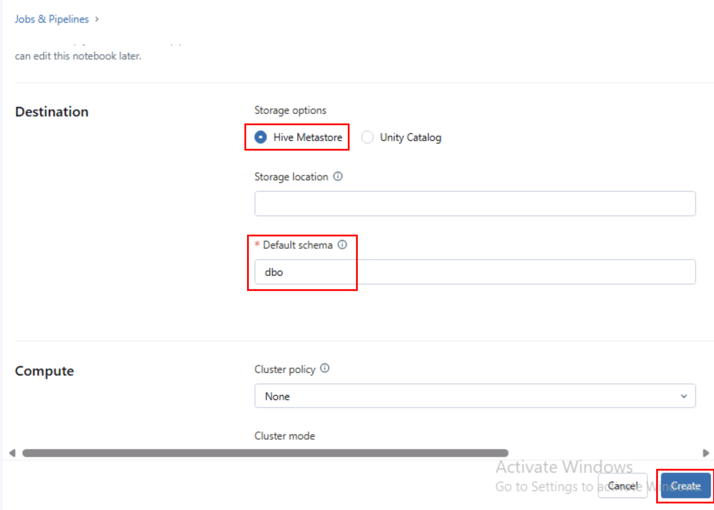
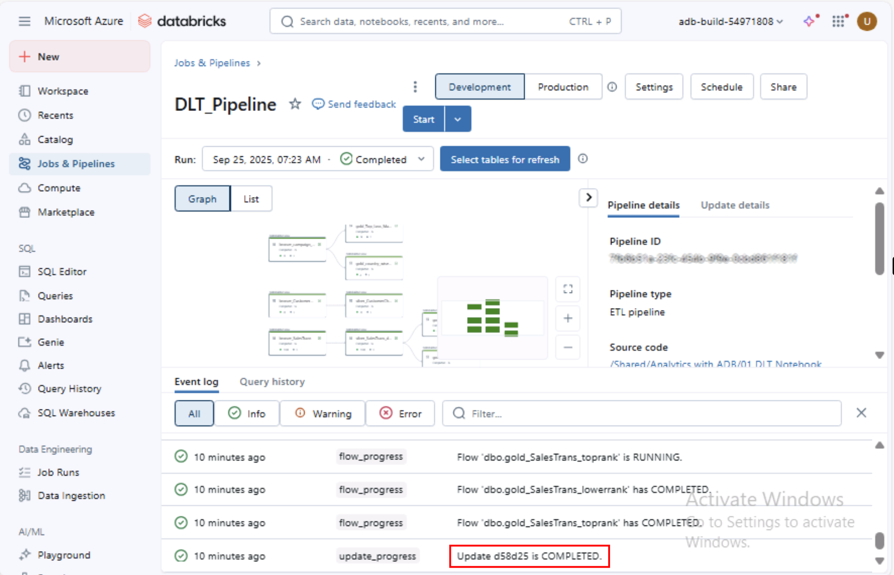

# Exercise 2: Build DLT Pipelines and Mirror Azure Databricks Catalog

This exercise shows how Microsoft Fabric with Azure Databricks enabled Zava to solve their integration challenges. The acquired company, Litware Inc., was already using Databricks heavily and they stored their churn and sales data in ADLS Gen2. We’ll see how Unity Catalog benefited Zava's data architects so they could quickly get up to speed on all Litware Inc.’s data.

## Task 2.1: Create Delta Live Table pipeline for Data Transformation

Delta Live Tables (DLT) allow you to build and manage reliable data pipelines that deliver high-quality data in Lakehouse. DLT helps data engineering teams simplify ETL development and management with declarative pipeline development, automatic data testing, and deep visibility for monitoring and recovery.

1. Open a new tab in your VM browser and navigate to `https://portal.azure.com/` then sign in using the credentials provided for this lab.
2. In the Azure portal, search for `rg-build-@lab.LabInstance.Id`. Select the resource group from the search results.

    

3. In your resource group search for `adb-build-25-@lab.LabInstance.Id` and select the Azure Databricks workspace from the search results.

4. Select the **Launch Workspace** button to open the Azure Databricks workspace.

    

5. Click on the **Sign in with Microsoft Entra ID**.

    

6. On the left navigation pane, select **Jobs and pipelines**.

7. Select the **Create** dropdown and choose **ETL Pipeline**.

    

8. In the **Create ETL Pipeline** page, provide a name for your pipeline as `DLT_Pipeline`, scroll down to **Paths** and select the folder icon to browse the notebook.

    

9. In the **Select file** dialog, select **Shared**, select **Analytics with ADB**, select **01 DLT Notebook** and then click on the **Select** button.

    

10. In the **Destination** section, enter `dbo` as the **Default Schema** then select **Create**.

    

11. Select **Start** to begin the pipeline execution.

    

Once the execution is completed, you will see a result similar to the following:

This beautiful lineage view showing the Medallion Architecture is a data design pattern commonly used in Databricks to organize and optimize data processing workflows in a lakehouse architecture. It structures data into three logical layers—Bronze, Silver, and Gold—ensuring data quality, accessibility, and scalability for analytics and machine learning.

### Next Step

> Select **Next >** to Analyze Campaign Performance using Power BI
