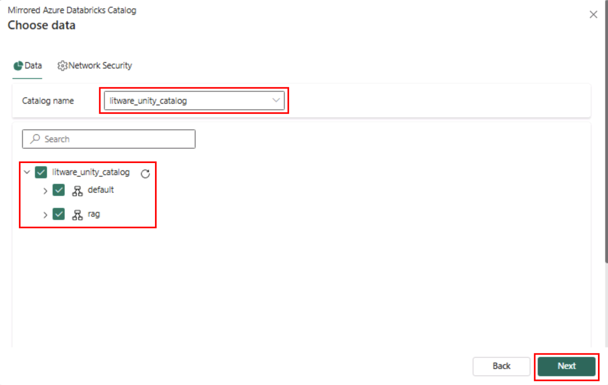

# Exercise 4: Ingest Data with Azure Databricks Mirroring in Fabric

## Task 4.1: Create a Mirrored Azure Databricks Catalog in Fabric and analyze data using T-SQL

Mirroring the Azure Databricks Catalog structure in Fabric allows seamless access to the underlying catalog data through shortcuts. This means that any changes made to the data are instantly reflected in Fabric, without the need for data movement or replication. Let’s step into Data Engineer, Eva’s shoes to create a Mirrored Azure Databricks Catalog and analyze the data using T-SQL. 

1. Navigate back to Microsoft Fabric tab on your browser (`https://app.fabric.microsoft.com`)

2. Select your **ZavaWorkspace_@lab.LabInstance.Id** workspace from the left navigation pane, and the select **+ New item** from the menu bar.

    

3. In the **New item** dialog, select **Mirrored Azure Databricks catalog** or search for it on the search bar.

    

4. When the **New Source** dialog appears, select the **New Connection** radio button.

5. In the **VM** environment open the **File explorer**, navigate to the **Downloads** folder and locate the **ConnectionDetails.txt** file. Open the file and copy the **Service Principal ID** and **Service Principal Key**.
6. After you have copied the **Service Principal ID** and **Service Principal Key**, navigate back to Microsoft Fabric and enter connection details by using the values in the table below. Make sure to leave all other settings at their default values.

    | Setting         | Value                                    |
    |--------------------|------------------------------------------|
    | Url               | `https://adb-2564561755692971.11.azuredatabricks.net`         |
    | Authentication Kind    | **Service Principal** |
    | Service principal client ID | Paste the copied Service Principal ID here          |
    | Service principal key              | Paste the copied Service Principal Key here                   |

7. Select **Connect** then select **Next**.

    

8. In the **Choose data** screen, select the Catalog name as **litware_unity_catalog** from the dropdown box. Ensure **default** and **rag** schemas are selected. Select **Next** and then select **Create**.

    

9. On the toolbar, select **Monitor catalog** to track the progress of the mirroring process. Wait for mirroring to complete.

10. On the toolbar, to the left of the **Share** button, select the dropdown list and then select **SQL analytics endpoint**.

11. On the toolbar, select **Refresh**. In the Explorer pane, in the **Schemas** section, expand **rag** and then expand **Tables**. You can view the Mirrored Azure Databricks catalog tables data here.

    

### Next Step

> Select **Next >** to build a Data Agent in Fabric
